# TP Optimisation Docker

## Conditions communes

### Environnement de mesure

- Processeur : Intel Core i5-12600KF.
- Docker Desktop avec des conteneurs Linux.
- Construction avec `--no-cache` pour désactiver le cache des instructions de build. Les couches de l'image de base peuvent toutefois être déjà présentes localement.

### Commandes

```powershell
#par exemple:
$version = "v0-baseline"
docker build --no-cache -t "node-app:$version" -f .\dockerfile .
docker run -d --name "node-app-$version" -p 3000:3000 "node-app:$version"
docker image ls --tree  "node-app:$version"
```

## Comparaison des optimisations

| Étape | Image | Disk Usage | Content Size | Réduction du contenu | Build avec `--no-cache` | Optimisation |
| :--- | :--- | :--- | :--- | :--- | :--- | :--- |
| **0 — Baseline** | `node-app:v0-baseline` | **1.93 GB** | **485 MB** | — | **46.2 s** | Image initiale non optimisée |
| **1 — Dockerignore** | `node-app:v1-dockerignore` | **1.93 GB** | **484 MB** | **≈ 1 MB (0.21 %)** | **15.9 s** | Réduction du contexte de build |
| **2 — Cache** | `node-app:v2-cache` | **1.93 GB** | **484 MB** | **0 MB (0 %) vs étape 1** | **16.7 s** | Réorganisation des couches pour réutiliser le cache des installations |
| **3 — Alpine** | `node-app:v3-alpine` | **283 MB** | **69.8 MB** | **≈ 414.2 MB (85.6 %) vs étape 2** | **20.4 s** | Base Alpine et suppression des paquets système supplémentaires |
| **4 — Dépendances de production** | `node-app:v4-production-deps` | **278 MB** | **68.9 MB** | **≈ 0.9 MB (1.3 %) vs étape 3** | **14.7 s** | Installation stricte sans dépendances de développement |

## Étape 0 — Baseline

### Résultats

- Image construite à partir du code source et du Dockerfile d'origine non modifiés.
- Taille sur disque : **1.93 GB**.
- Taille du contenu : **485 MB**.
- Temps de construction à froid : **46.2 secondes**.
- Mesure complémentaire avec la base déjà disponible localement et `--no-cache` : **13.9 secondes**. Le code provient du commit `117acfc` dans une copie isolée ; la référence de base est fixée au digest de la mesure initiale pour conserver la même version. L'étape `FROM` affiche **0.0 s**, sans téléchargement des couches ; les installations npm et système sont réexécutées.

### Preuves d'exécution

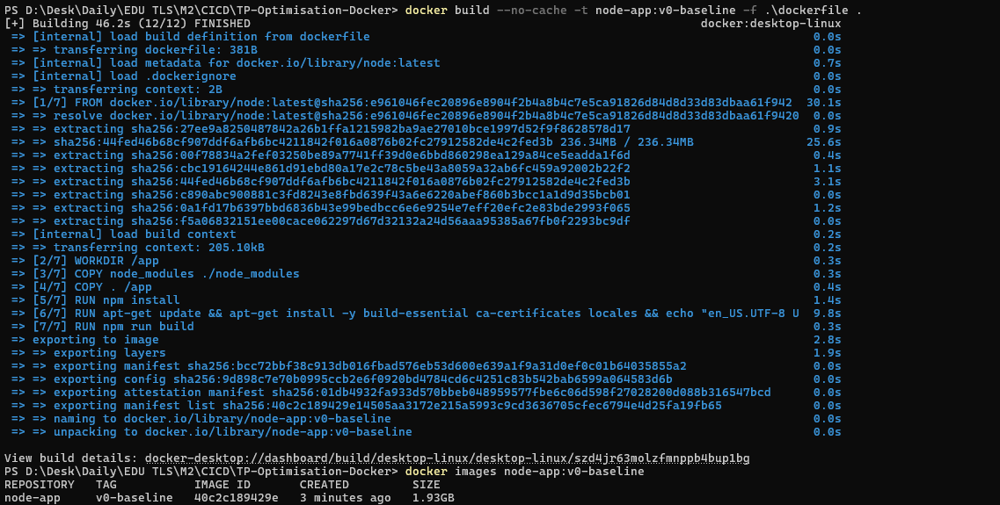

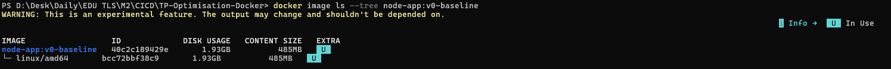

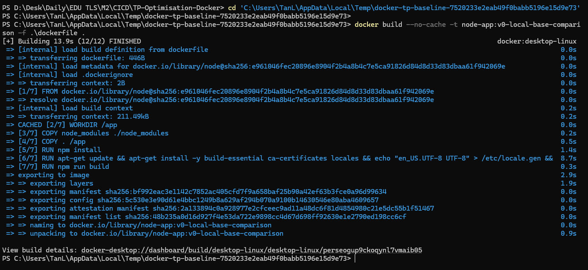

## Étape 1 — Réduction du contexte de build

### Pourquoi ajouter un `.dockerignore` ?

Le contexte de build regroupe les fichiers accessibles à Docker pendant la construction. Avec `COPY . /app`, les fichiers non exclus du contexte sont copiés dans l'image, y compris les dépendances locales, les données Git et la documentation.

Le fichier `.dockerignore` exclut les éléments inutiles à la construction et à l'exécution de l'application. Cela réduit les fichiers à transmettre et à copier, et évite que des modifications de documentation ou de journaux invalident le cache de cette instruction lors des builds avec cache. Les fichiers restent présents sur la machine ; les règles n'affectent pas leur suivi par Git.

### Modifications

- **Ajout du `.dockerignore` :**

```dockerignore
node_modules/
.git/
docs-images/
README.md
*.log
```

`node_modules/` est exclu car les dépendances sont installées dans l'image, ce qui évite aussi les incompatibilités possibles entre Windows et Linux. `.git/` contient l'historique de version, inutile au serveur. `docs-images/` et `README.md` servent uniquement au compte rendu du TP. `*.log` exclut les journaux locaux à la racine, inutiles au build. Ces règles ne suppriment aucun fichier local et n'affectent pas leur suivi par Git.

- **Adaptation du `Dockerfile` :**

Suppression de la copie locale des dépendances :

```dockerfile
COPY node_modules ./node_modules
```

Ce dossier n'étant plus accessible dans le contexte de build, cette instruction échouerait. Les dépendances sont directement générées dans l'image par `RUN npm install`.

### Impact

La taille du contenu passe de **485 MB à 484 MB**, soit une réduction d'environ **1 MB (0,21 %)**.

Le principal effet du `.dockerignore` est de réduire le contexte de build et d'éviter la copie de fichiers inutiles dans l'image.

Le temps de build mesuré passe de **46.2 s à 15.9 s**, mais cette différence ne peut pas être attribuée uniquement au `.dockerignore`, certaines couches de l'image de base pouvant déjà être présentes localement.

### Preuves d'exécution

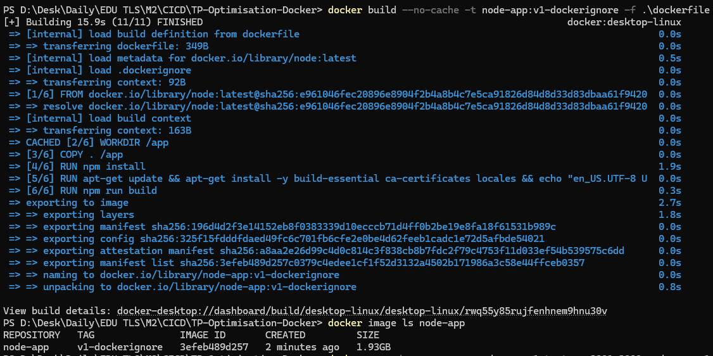

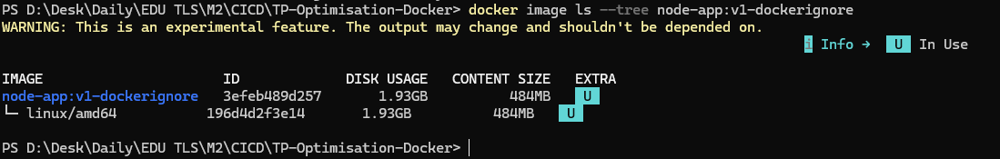

## Étape 2 — Réutilisation du cache des dépendances

### Pourquoi réorganiser les instructions ?

À l'étape 1, `COPY . /app` précède les installations npm et système. Une nouvelle version de `server.js` peut donc entraîner leur réexécution, même lorsque les dépendances restent identiques.

Séparer la copie des fichiers de dépendances de celle du code permet de conserver le cache des installations lorsque seul le code du serveur change.

### Modifications

- **Copie des fichiers de dépendances avant l'installation :**

```dockerfile
COPY package.json package-lock.json ./
RUN npm install
```

`package.json` déclare les dépendances et les scripts du projet ; `package-lock.json` enregistre les versions résolues.

- **Déplacement de la copie du code après les installations npm et système :**

```dockerfile
COPY . /app
```

Lorsque les fichiers de dépendances restent identiques et que le cache est disponible, Docker réutilise les couches d'installation. La nouvelle copie du code et le build sont exécutés si aucun cache correspondant à ce contenu n'existe déjà. Les commandes d'installation et les paquets restent inchangés.

### Impact

Cette optimisation vise à réduire le temps de reconstruction ; elle n'entraîne donc pas de réduction visible de la taille par rapport à l'étape 1.

| Mesure de l'étape 2 | Résultat |
| :--- | ---: |
| Build avec `--no-cache` | **16.7 s** |
| Build avec réutilisation du cache existant | **1.6 s** |
| Reconstruction après modification de `server.js` (`node-app:v2-cache-test`) | **2.2 s** |

Lors du test suivant, après modification de `server.js`, `COPY package.json package-lock.json ./`, `RUN npm install` et l'installation des paquets système affichent toujours `CACHED`, tandis que `COPY . /app` et `RUN npm run build` sont réexécutés, pour un temps total affiché de **2.2 secondes**.

### Preuves d'exécution

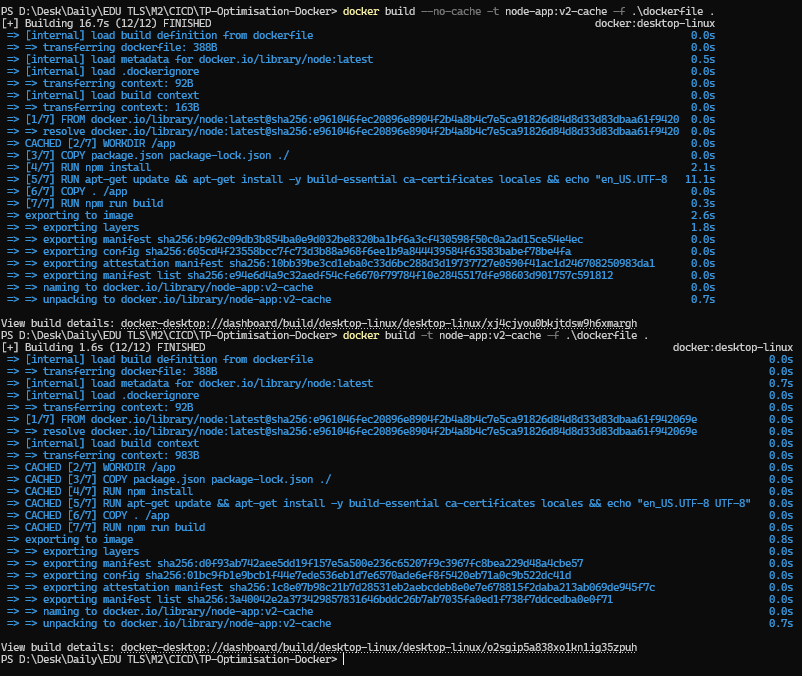

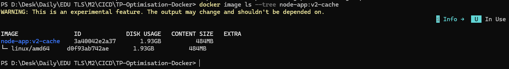

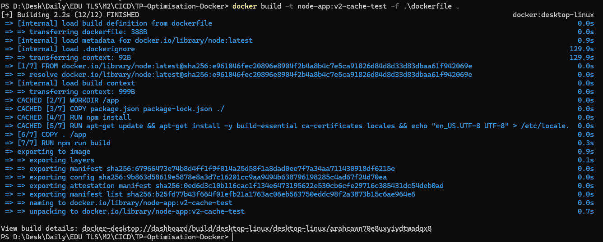

## Étape 3 — Passage à une base Alpine

### Pourquoi utiliser Alpine ?

L'image `node:latest` repose sur une base Debian contenant de nombreux outils système. La variante `node:alpine` fournit Node.js et npm sur une base plus légère. L'objectif est de réduire la taille de l'image tout en conservant le fonctionnement du serveur.

### Modifications

- **Remplacement de l'image de base :**

```dockerfile
FROM node:alpine
```

- **Suppression de l'installation des paquets Debian et de la génération de locale :**

```dockerfile
RUN apt-get update && apt-get install -y build-essential ca-certificates locales && echo "en_US.UTF-8 UTF-8" > /etc/locale.gen && locale-gen
```

Alpine utilise `apk` à la place d'`apt-get`, mais aucune installation système supplémentaire n'est nécessaire pour les fonctionnalités testées. Les dépendances actuelles ne montrent pas de besoin de compilation native sous Linux et le script `build` se limite à un affichage.

### Impact

| Mesure | Étape 2 | Étape 3 | Réduction |
| :--- | ---: | ---: | ---: |
| Disk Usage | 1.93 GB | **283 MB** | **≈ 85.3 %** |
| Content Size | 484 MB | **69.8 MB** | **≈ 85.6 %** |

L'utilisation de l'espace disque (Disk Usage) et la taille du contenu (Content Size) diminuent considérablement. Cela résulte principalement du passage à une base Alpine et de la suppression des paquets système supplémentaires.

Les temps de build des différentes étapes ne sont pas directement comparables, car l'état du cache local et les images de base disponibles au moment des mesures peuvent différer. L'option --no-cache désactive la réutilisation du cache des instructions du Dockerfile, mais n'empêche pas Docker d'utiliser une image de base déjà présente localement.

Une fois l'image node:alpine disponible localement, une nouvelle construction avec --no-cache prend environ 4.5 s.

### Vérification manuelle

Les vérifications manuelles ont confirmé le fonctionnement du serveur sous Alpine sans problèmes.

### Preuves d'exécution

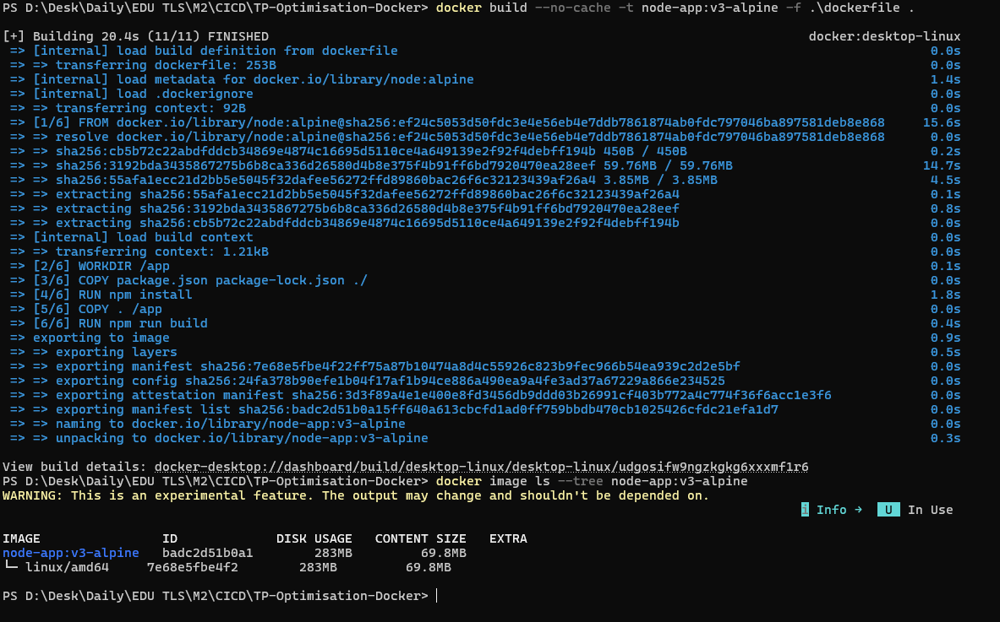

## Étape 4 — Installation des dépendances de production

### Pourquoi exclure les dépendances de développement ?

Le conteneur démarre avec `node server.js`. Il n'utilise pas `nodemon`, destiné au redémarrage automatique pendant le développement. Installer cet outil et ses dépendances spécifiques dans l'image augmente sa taille sans contribuer au fonctionnement du serveur.

### Modifications

Remplacement de `RUN npm install` par :

```dockerfile
RUN npm ci --omit=dev
```

`npm ci` installe les versions du fichier `package-lock.json` sans le modifier et échoue si les déclarations de dépendances ne correspondent pas à `package.json`. L'option `--omit=dev` exclut du disque les dépendances réservées au développement. `nodemon` reste déclaré pour le développement local ; `express` et `mongodb`, déclarés dans `dependencies`, restent installés dans l'image.

Le script `build` actuel se limite à un affichage et ne nécessite aucun outil de développement. Cette sélection des dépendances ne change pas le mode d'exécution du serveur : la configuration `NODE_ENV=development` reste celle des étapes précédentes.

### Impact

| Mesure | Étape 3 | Étape 4 | Réduction |
| :--- | ---: | ---: | ---: |
| Disk Usage | 283 MB | **278 MB** | **≈ 5 MB (1.8 %)** |
| Content Size | 69.8 MB | **68.9 MB** | **≈ 0.9 MB (1.3 %)** |

Les réductions sont calculées à partir des valeurs arrondies affichées par Docker. L'exclusion des dépendances de développement apporte un gain de taille modeste ; `npm ci` assure en complément une installation stricte à partir du verrouillage existant.

| Conditions de construction | Temps total |
| :--- | ---: |
| `--no-cache`, image de base déjà disponible localement | **4.7 s** |
| Après nettoyage des images et du cache, avec `--pull --no-cache` et téléchargement de la base | **14.7 s** |

Par comparaison avec l'étape 3, la durée de construction reste proche lorsque l'image de base est déjà disponible localement : environ **4.5 s** contre **4.7 s**. Avec téléchargement de la base, le total passe de **20.4 s** à **14.7 s**. Cet écart est principalement lié au temps de téléchargement et d'extraction de la base, passé de **15.6 s** à **10.5 s**, et dépend notamment du débit réseau.

### Preuves d'exécution

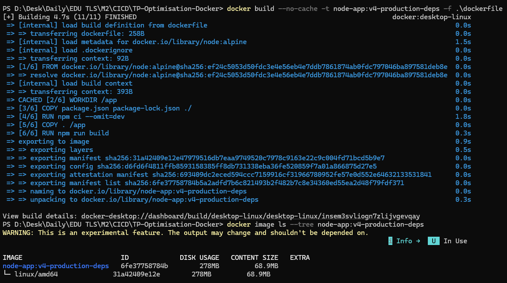

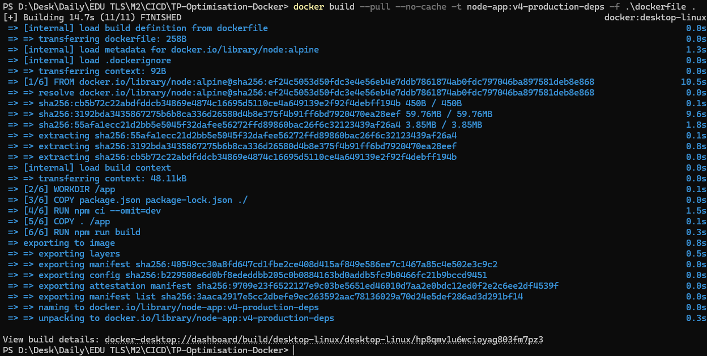
